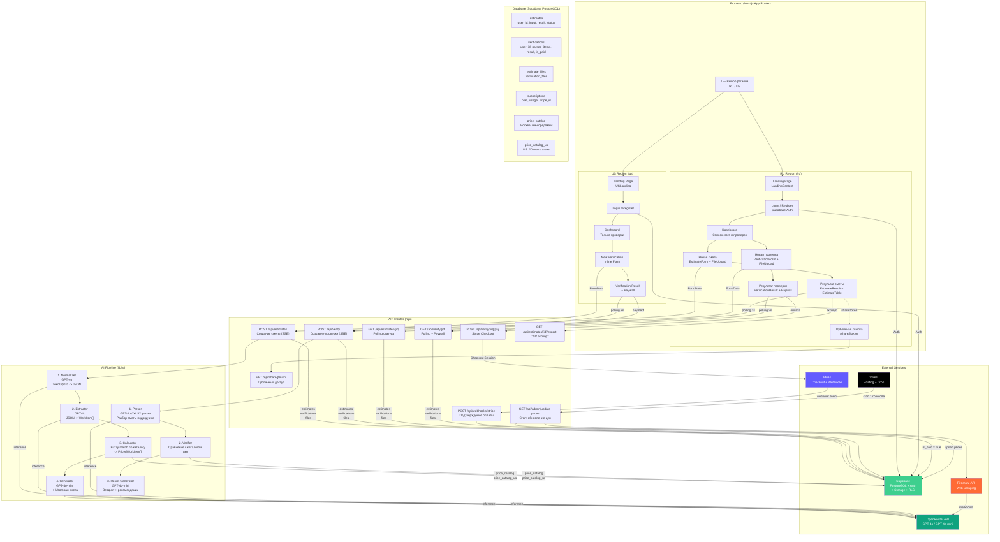
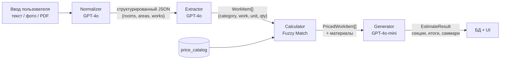
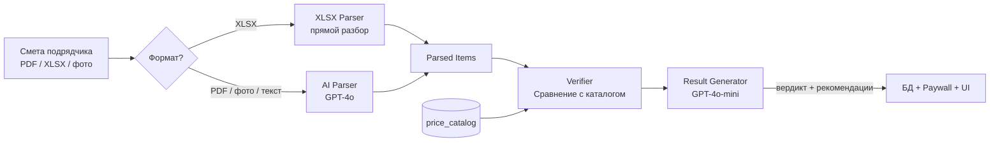
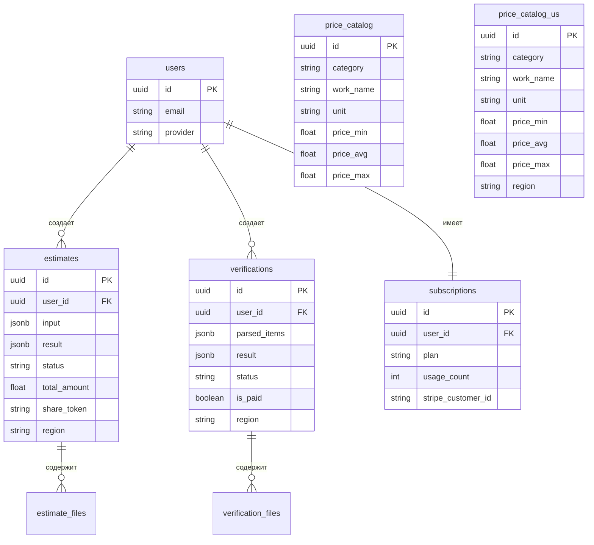

# Архитектура проекта AI Smetchik / ContractorCheck

## Общая схема

## Потоки данных

| Поток | Описание |
|---|---|
| **Создание сметы** | Форма -> API (SSE) -> Normalizer -> Extractor -> Calculator (каталог цен) -> Generator -> БД -> Polling -> UI |
| **Проверка подрядчика** | Форма + файл -> API (SSE) -> Parser (AI/XLSX) -> Verifier (каталог цен) -> Result Generator -> БД -> Paywall -> UI |
| **Оплата** | Кнопка "Разблокировать" -> Stripe Checkout -> Webhook -> `is_paid=true` -> Полный результат |
| **Обновление цен** | Vercel Cron -> Firecrawl (скрейпинг) -> GPT-4o-mini (извлечение) -> Агрегация (IQR) -> Upsert в БД |

## AI Pipeline: Создание сметы

## AI Pipeline: Проверка подрядчика

## Структура базы данных

## Стек технологий

| Слой | Технологии |
|---|---|
| **Frontend** | Next.js 15, React 19, TypeScript, Tailwind CSS v4, shadcn/ui |
| **Backend** | Next.js API Routes, SSE streaming |
| **AI** | OpenRouter (GPT-4o, GPT-4o-mini) |
| **БД / Auth** | Supabase (PostgreSQL + Auth + Storage + RLS) |
| **Платежи** | Stripe (Checkout + Webhooks) |
| **Скрейпинг** | Firecrawl API |
| **Хостинг** | Vercel (+ Cron Jobs) |
| **Парсинг файлов** | pdf-parse-fork, xlsx |
